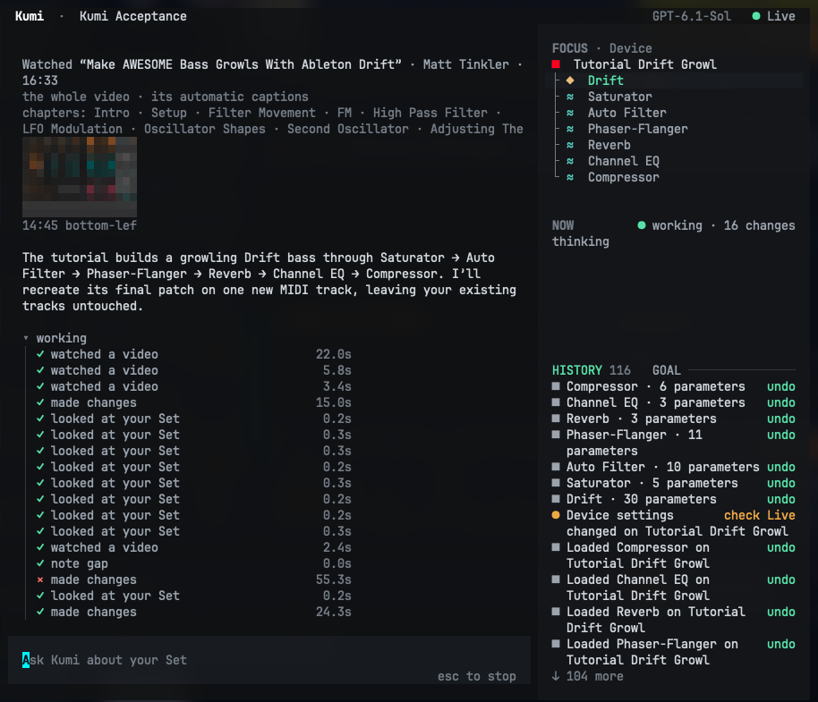

<p align="center">
  
</p>

<p align="center">
  <a href="https://github.com/user1303836/kumi/actions/workflows/kumi.yml"></a>
  <a href="https://github.com/user1303836/kumi/releases/latest"></a>
  
  
  <a href="LICENSE.md"></a>
</p>

<p align="center">
  <a href="README.md">English</a> · 简体中文 · <a href="README.ja.md">日本語</a>
</p>

**为 Ableton Live 打造、会学习你工作方式的录音室搭档。** 用平常的话告诉 Kumi 你想要什么，它就在你的工程里动手完成，从繁琐的杂活，到你根本没时间琢磨的事情：照着 YouTube 教程重建一个声音、把你的混音与参考曲对比、编写你描述的 Max for Live 设备，或者改造你指着的那个机架。每项修改都有各自的撤销，不会有任何事在你背后发生；它还会记住你保留下来的技巧，所以每次使用都更贴合你。

<p align="center">
  
</p>

## 它能做什么

- **修改工程里几乎任何东西：** 速度、音阶与律动；调音台、路由与侧链；轨道、场景与片段；音符与 MIDI 变换；设备、机架及其参数。每项修改都可单独撤销。
- **聆听：** 混音、采样或它自己弹出的音频的响度、音色平衡、声像宽度、速度与调性，以及你的混音与参考曲的差别。
- **观看教程：** 观看 YouTube 或本地文件中的视频，并在新轨道上搭建出教程里做的内容。
- **播放、录音与重采样**，在你要求时进行。
- **全面掌控 Live：** 按你的要求删除内容，把 MIDI 直接写进编曲视图，离线渲染，并回答你在 Live 中右键指向的对象（“Ask Kumi about this”）。整个计划只需按一次 Cmd-Z 即可撤销。几百条轨道的大工程也一样快。
- **制作 Max for Live 设备：** 按你的描述制作 MIDI 效果器、音频效果器和乐器，并放到你的轨道上。
- **查找资料：** 搜索网络，阅读网页、PDF、说明书和 GitHub 上的代码，从而能照着读到的资料做出类似的效果器。
- **显示你在哪里：** FOCUS 跟随你在 Live 中触碰的对象，显示为设备树、钢琴卷帘，或 Session、Arrangement 视图的条带。点击某个设备即可指向它：“这个 Saturator 太刺耳了”。
- **记住：** 关于你和每个工程的笔记、从你保留的声音中学到的技巧，以及可重放的配方。每次保存都会显示，点一下就能让它忘掉。
- **保存对话：** 为每个工程保存对话，并告诉你它关闭期间发生了哪些变化。
- **用你的模型：** 使用 ChatGPT 登录，或使用 OpenAI、Anthropic、OpenCode 的 API 密钥。

## 开始使用

需要 Ableton Live 12 Beta，运行在 macOS 13 或更高版本，或 Windows 10、11 上。其余所需的一切（包括 Node）都由 Kumi 自带。

**macOS：** 打开“终端”，粘贴：

```sh
curl -fsSL https://raw.githubusercontent.com/user1303836/kumi/main/install.sh | sh
```

**Windows：** 打开 PowerShell，粘贴：

```powershell
irm https://raw.githubusercontent.com/user1303836/kumi/main/install.ps1 | iex
```

然后在新的终端窗口中：

```sh
kumi login      # 使用 ChatGPT 登录，或使用 Anthropic、OpenAI、OpenCode 的密钥
kumi bridge     # 在 Live 关闭时：把 Kumi 连接到 Live（只需一次）
kumi            # 在你的工程旁打开 Kumi
```

之后首次打开 Live 时，请在 Live 的 **Settings → Link, Tempo & MIDI** 中将 **AbletonMcpBridge** 选为控制界面（Control Surface）。之后 Kumi 会自己找到 Live。

遇到问题？`kumi doctor` 会检查所有环节并告诉你该运行什么。`kumi report` 把出错的情况整理成一个可以发给我们的文件。`kumi uninstall` 会卸载 Kumi。

有新版本时，Kumi 会在启动时告诉你。在 Kumi 中输入 `/update`，或在终端运行 `kumi update`，即可更新，桥接也会一并更新；`kumi update --check` 只检查、不安装，`kumi update --rollback` 回到上一个版本。如果不想让它检查，在 `~/.kumi/settings.json` 中加入 `"updateCheck": false`。

在 Kumi 中输入 `/` 查看命令。Esc 停止 Kumi 正在做的事，`/stop` 停止 Live。Kumi 工作时，按 Enter 可以补充说明（它会在当前这一步之后读到），按 Tab 发送一条等它做完再处理的消息，`/btw` 可以顺便问个问题而不打断它。

[完整指南（英文）](docs/en/KUMI_POC.md) · [命令与界面（英文）](docs/en/KUMI_TUI.md) · [更新日志（英文）](CHANGELOG.md)

## 当前状态

Kumi 1.6 已在 macOS 和 Windows 上的 Ableton Live 12.4（测试版）中测试。接下来将支持 Renoise 和 Reaper。

## 开发

在本仓库的副本中，使用 Node.js 22 或 24：

```sh
npm run setup     # 安装并构建
npm run kumi      # 运行（npm run kumi -- bridge、-- doctor 等）
npm run typecheck
npm test          # 无需 Live 或登录
node scripts/build-release.mjs   # 生成安装程序下载的包（Node 24）
```

`apps/kumi` 是终端应用；`packages/runtime` 包含 Kumi 的代理核心、模型提供方、记忆、音频分析以及与 Live 的集成。Kumi 通过本地桥接（`apps/mcp-server` 及其 Remote Script）与 Live 通信，该桥接也可由其他 MCP 客户端单独使用（[桥接指南（英文）](apps/mcp-server/README.md)）。

## 许可证

[MIT](LICENSE.md)。Ableton Live 是 Ableton AG 的商标；Kumi 与 Ableton 没有关联，也未获其认可。
